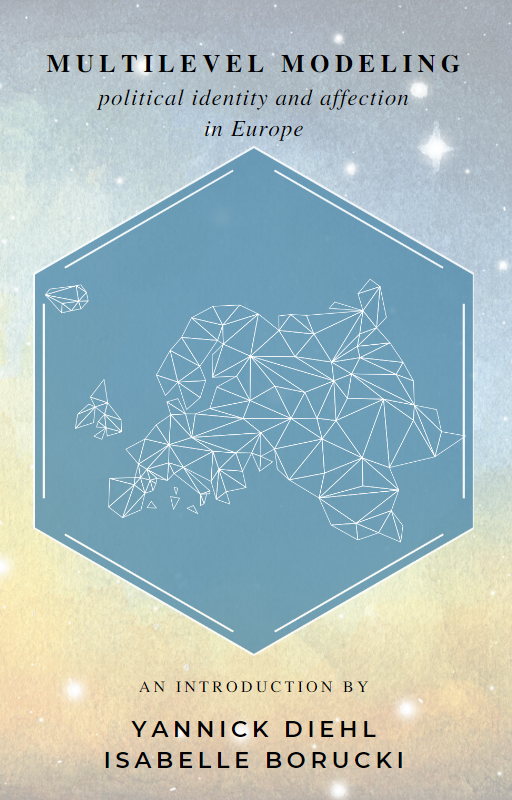

# Multilevel Modeling UMR SoSe 23  

This repository contains the source of [Multilevel Modeling on political identity and affection in Europe](https://yannickdiehl.github.io/MultilevelModelingUMR23/).
The book is built using [Quarto](https://quarto.org/).

The MA-Seminar: Multilevel-modelling of political identity concepts with standard data in RStudio/Posit (lme4 and others), is designed for students of political science who are interested in learning about multilevel analysis and advanced regression models. The primary goal of this seminar is to explore how political identity and affection are measured in large surveys such as the ESS and how these measures fit with theories of political identity.

The syllabus for this seminar will cover various sessions on how and why we model data at several levels, including the potential boundaries in this process. 

## What is Multilevel Modeling?

The multilevel regression modeling will be used in this research agenda to examine the relationship between political identity and other relevant variables such as socio-economic status, gender, or age. The multilevel approach allows us to account for the hierarchical structure of the data and to estimate the effects of individual and group-level variables on the outcome of interest. In RStudio, the lme4 package is a popular tool for implementing multilevel regression models, and students will have hands-on practice in using this package to analyze the data. By the end of this seminar, students will gain a thorough understanding of how to conduct multilevel analysis using R and will be able to apply these techniques to their own research projects.
